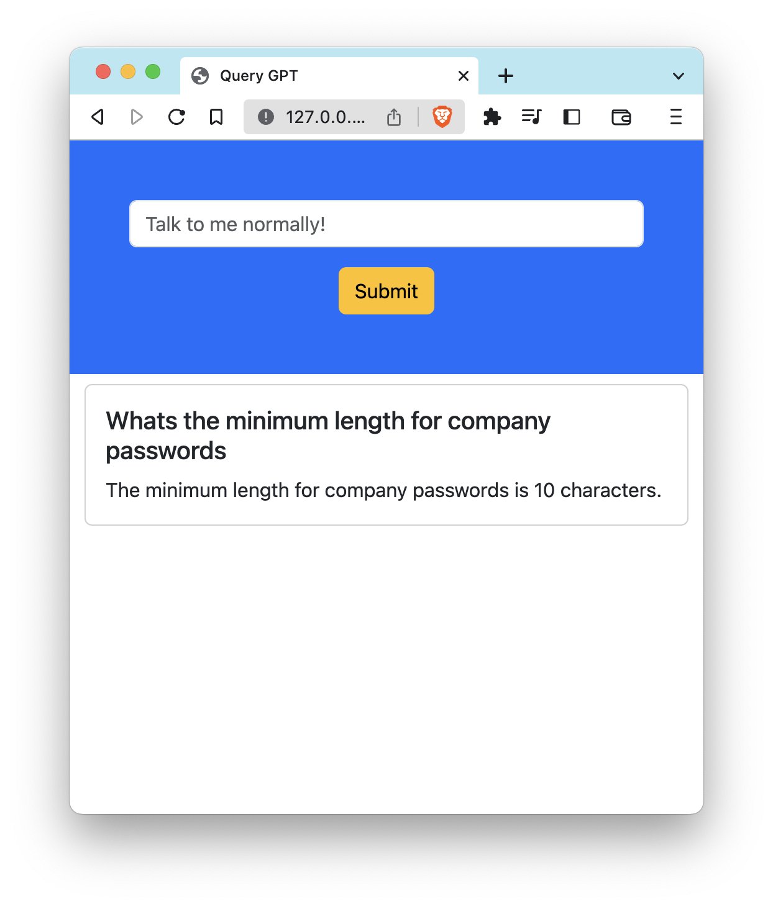
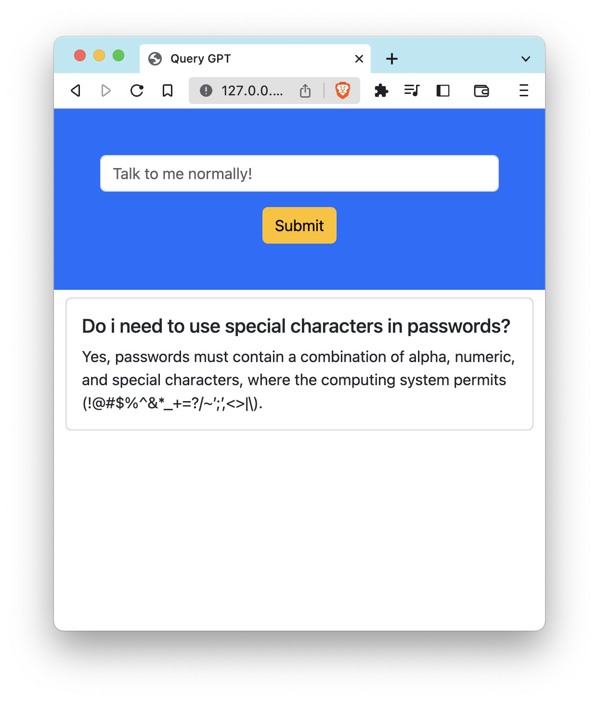
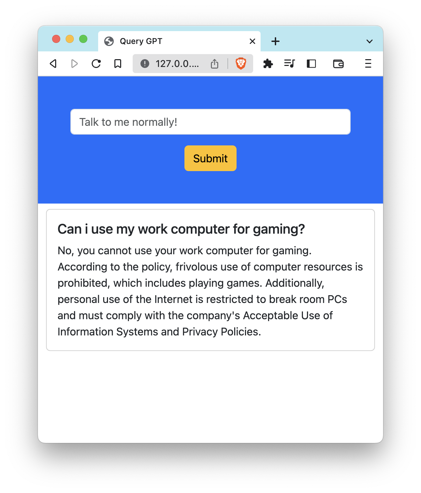

Using ChatGPT 😁 and other Large Language Models (LLM's) for querying the internet in natural language is pretty cool, but how about your own company data? 👊🏼

The opportunities have immediate ROI.

Here's some examples.

>⚡️ Imagine querying your employee intranet for a summary of what the CEO and senior leadership have been publishing lately?

>⚡️ How about asking your user security activity log data when someone last logged in, and what device and IP they were using?

>⚡️ Or how about asking what your company password policy is, or to give details about acceptable use?

In this article, we will setup a web site that let's you do exactly that, your own company GPT bot, in only 32 lines of code.

If you want to "talk" to your company's data and get answer's in natural language, this is for you.

## Application overview

`app.py` is quite simple.  You feed it some company data.  In this example, i have downloaded several public security policies from purplesec and stored them into a `data` directory.  The app uses `llama_index` to load the files, then it will learn everything contained within those files, then it taps into OpenAI's GPT LLM, so that it can respond to your questions in natual language.

⚡️ If you understand Google Search, ChatGPT and ChatBots, this is no different, except you get much better results, fine tuned and contextualised in normal human talk.

There's already "hundred's" of tutorials out there doing this, so i won't provide much more detail than the brief description above.

## Setup overview

✅ Get a computer, get the latest Python, create a virtual environment and install the required modules.

✅ Create a `.env` file and put in your `OPENAI_API_KEY=nnn`

✅ Create an `app.py` file, this is the main application file.

✅ I used Flask for the web server and made use of its templates module and some Bootsrap CSS for a little styling.

✅ Clone https://github.com/adrwh/query-with-gpt.git and get running in minutes.

### Documentation here!

📂 https://gpt-index.readthedocs.io/en/latest/getting_started/starter_example.html 

📂 https://gpt-index.readthedocs.io/en/latest/guides/tutorials/fullstack_app_guide.html

## Finished product

⚡️ Now you can simply run the app, and start talking to it!

**Query:** Whats the minimum length for company passwords?

**Query:** Do i need to use special characters in passwords?

**Query:** Can i use my work computer for gaming?

>Note:  This is not production code, and should not be make public.